# DUST fee sponsorship (gasless UX) on Midnight

## What this shows

On Midnight, transaction fees are paid in **DUST**. DUST is not transferable — it is
*generated* by NIGHT held under a public key that has been **registered for DUST
generation**. The ledger keeps a Registration Table linking NIGHT public keys to
DUST public keys, and a DUST UTXO is created only when a NIGHT UTXO is created *and* its
key has an entry in that table.

The consequence trips people up: **a wallet can hold plenty of NIGHT and still be unable
to submit a single transaction.** If its key was never registered, its NIGHT generates no
DUST, and with zero DUST there is no fee it can offer — even for a transaction that moves
no funds at all.

**Fee sponsorship** is the fix. It separates *who is authorized to act* from *who pays the
fee*, so a DApp can offer a genuinely gasless experience to users who should never have to
think about DUST.

This repository contains a working, tested example. In it, **Dave** is a party guest who
holds NIGHT for the entry fee but has never registered for DUST generation, so his DUST
balance is exactly zero. **Alice**, the party organizer, sponsors her guests: she attaches
DUST to Dave's already-proven transactions so he can RSVP and check in.

> There is one way to bootstrap without a sponsor, worth knowing so you can tell when
> sponsorship is the right tool: a first-time `DustRegistration` carries an
> `allowFeePayment` field — a Speck-denominated *allowance*, not a boolean flag — which
> lets the registration draw on retroactively generated DUST to pay for itself. It is
> limited: only not-yet-generating NIGHT UTXOs spent in the transaction's guaranteed
> section count toward it, the allowance cannot exceed what those inputs virtually
> accrued, and it covers that one transaction. Sponsorship covers everything else.

### Units, so the numbers in the logs make sense

| Token | Atomic unit | Ratio |
| ----- | ----------- | ----- |
| NIGHT | STAR        | 1 NIGHT = 10<sup>6</sup> STAR |
| DUST  | SPECK       | 1 DUST = 10<sup>15</sup> SPECK |

The party's entry fee is `FEE = 5`, i.e. 5 STAR — `entryFee` is declared `Uint<16>` in the
contract, so it cannot express a whole NIGHT.

## The two-sided split

The mechanism is the `tokenKindsToBalance` option on the wallet facade's balancing methods.
It lets each party balance **only its own slice** of one transaction:

| Party   | Method                        | `tokenKindsToBalance`        | Pays for            |
| ------- | ----------------------------- | ---------------------------- | ------------------- |
| User    | `balanceUnboundTransaction`   | `['shielded', 'unshielded']` | its own value       |
| Sponsor | `balanceFinalizedTransaction` | `['dust']`                   | the transaction fee |

Omit the option and it defaults to `'all'`, which is the ordinary self-paying path that
`balanceTx` uses everywhere else in this repository.

**Order matters, and it is the whole security argument.** The user proves, balances, signs
and **finalizes (binds)** first. What crosses the wire to the sponsor is an already-bound
`FinalizedTransaction`: the sponsor can add a DUST fee offer to it and nothing else. It
cannot change what the transaction does, and it never sees the user's private circuit
inputs — because the *user*, not the sponsor, generated the proof.

This ordering matches the wallet SDK's own reference snippet,
[`packages/docs-snippets/src/snippets/dust-sponsorship.ts`](https://github.com/midnightntwrk/midnight-wallet/blob/main/packages/docs-snippets/src/snippets/dust-sponsorship.ts).

## Sequence

```mermaid
flowchart LR
    subgraph U["Dave — guest, 0 DUST"]
        direction TB
        U1["createUnprovenCallTx(checkIn)"]
        U2["proofProvider.proveTx(...)"]
        U3["balanceUnboundTransaction(['shielded','unshielded'])<br/>pays the NIGHT entry fee"]
        U4["signRecipe (Dave's signature)"]
        U5["finalizeRecipe() → FinalizedTransaction"]
        U1 --> U2 --> U3 --> U4 --> U5
    end

    subgraph S["Alice — organizer, holds DUST"]
        direction TB
        S1["POST /sponsor { tx }"]
        S2["Transaction.deserialize('signature','proof','binding')"]
        S3["balanceFinalizedTransaction(['dust'])<br/>pays the fee"]
        S4["signRecipe (Alice's signature)"]
        S5["finalizeRecipe()"]
        S6["submitTransaction() → txId"]
        S1 --> S2 --> S3 --> S4 --> S5 --> S6
    end

    U5 -- "hex (FinalizedTransaction)" --> S1
```



The hex string between the two halves is the network boundary. In this repository both
halves run in one test process; in production `prepareSponsoredCall` runs in the user's
browser and `sponsorAndSubmit` runs on the sponsor's server.

## The code

Everything specific to sponsorship lives in two files.

**[`src/sponsor.ts`](../src/sponsor.ts)** — the reference implementation, two functions
either side of that hex boundary:

- `prepareSponsoredCall(...)` — USER side: build, prove, balance own value, sign, bind,
  return hex. A wallet with zero DUST can run every line of it.
- `sponsorAndSubmit(...)` — SPONSOR side: deserialize, attach a DUST fee offer, sign,
  finalize, submit.

**[`src/wallet.ts`](../src/wallet.ts)** — the two role-named balancing methods. The secret
keys stay private to the wallet; only the roles are exposed:

```ts
// balanceOwnValueAndFinalize — the USER's half
{ ttl, tokenKindsToBalance: ['shielded', 'unshielded'] }

// addDustFeesAndFinalize — the SPONSOR's half
{ ttl, tokenKindsToBalance: ['dust'] }
```

Those two lines are the entire idea. Everything else is plumbing.

One API detail worth copying exactly: reconstructing the user's transaction needs explicit
type arguments, because the marker triple alone infers a wider type that is not assignable
to `FinalizedTransaction`:

```ts
Transaction.deserialize<SignatureEnabled, Proof, Binding>('signature', 'proof', 'binding', bytes)
```

## Why the sponsor gains no authority

Alice pays for every transaction Dave sends, and she still cannot act as him:

1. **The user generates the proof.** Private circuit inputs never reach the sponsor.
2. **The user signs and binds before handing over.** The sponsor receives a bound
   `FinalizedTransaction` and can only add a fee offer to it.
3. **The contract authenticates by secret, not by fee payer.** `checkIn` recomputes
   `commitAddress(_secret, address.bytes)` and requires the result to be on the RSVP list.
   That commitment binds Dave's secret, which Alice does not have.

Point 3 is not an assertion — it is an executable test. `Alice cannot check in as Dave` in
[`src/test/sponsorship.test.ts`](../src/test/sponsorship.test.ts) has Alice attempt
`checkIn` with Dave's address and her own secret, *after* the party has started so the call
reaches the caller-authentication check rather than aborting on the state machine. It fails
with `"You are not on the list"`.

**The general principle: never authenticate a caller by who paid.** Under sponsorship the
fee payer and the actor are by design different parties, so any check that conflates them
is wrong twice over. `ownPublicKey()` is a prover-controlled witness and must not be
treated as an authenticated caller — see
[Compact smart contract security](https://docs.midnight.network/compact/smart-contract-security).

## Running it

```bash
yarn env:up          # local devnet: node, indexer, proof server
yarn wait:dust       # block until the sponsor actually has spendable DUST
yarn test:sponsorship
```

The suite proves the premise before it demonstrates the fix — it asserts that Dave holds
NIGHT, that every one of his UTXOs reports `registeredForDustGeneration === false`, and
that his DUST balance is `0n`. It then shows him RSVPing and checking in anyway, and
re-asserts his DUST is still exactly zero afterwards.

The headline test prints the whole argument in four lines:

```
=================== fee sponsorship ===================
  Dave  NIGHT (STAR) : 1000 -> 995  (delta -5)
  Dave  DUST (SPECK) : 0 -> 0
  Alice DUST (SPECK) : 1249999999038849166973156 -> 1249999998991990911793183  (delta -46858255179973)
  Dave paid the entry fee; Alice paid the transaction fee.
=======================================================
```

Dave's NIGHT falls by exactly the 5 STAR entry fee — he bought his own ticket. His DUST
never moves off zero, because he never paid a transaction fee. Alice's DUST is what fell.
One transaction, two payers.

To run the sponsor as a real HTTP service instead:

```bash
yarn sponsor:serve   # GET /health, POST /sponsor { "tx": "<hex>" }
```

## Adapting it to your DApp

- The **user** needs a proof server and their own private inputs. They do **not** need DUST.
- The **sponsor** needs NIGHT that is *registered for DUST generation*. Plain NIGHT is not
  enough — an unregistered sponsor is just as stuck as the user it is trying to help.
- Move the hex boundary onto a real HTTP call. `scripts/sponsor-service.ts` shows the shape.
- **Authenticate and rate-limit the sponsor endpoint**, cap what it will pay for, and check
  that the transaction targets your own contract before paying for it. The bundled service
  does none of this and says so.
- If the call moves user value — like the entry fee here — that value still comes from the
  **user's** balance. Sponsorship covers fees, not funds.

## Troubleshooting

**`could not balance dust` on the sponsor side.** The sponsor's DUST does not cover fee plus
overhead. Check `yarn wait:dust` succeeded, and remember DUST accrues over time rather than
appearing at once. `src/wallet.ts` sets `additionalFeeOverhead: 1_000n`, which adds headroom
on top of the SDK default of `0n`.

**The user's balancing step fails.** If the circuit moves value (like `checkIn`'s entry
fee), the *user* must still be able to fund that. Sponsorship pays the fee, not the payload.

**`Dave has DUST` on a remote network.** The demo needs a wallet with none. Fund
`MIDNIGHT_<NET>_DAVE_SEED` with tNIGHT but do not delegate DUST to it.

**The sponsored transaction expires.** The real deadline is the intent TTL fixed when the
transaction is constructed, not the `ttl` passed on the user's balancing call — that one is
inert once `'dust'` is excluded. Do not let a transaction sit in a queue on the sponsor's
side.

**Both suites interfere with each other.** They share one devnet and one Alice wallet, so
`vitest.config.ts` sets `fileParallelism: false`. Concurrent spends of the same UTXOs
produce nondeterministic balancing failures.
